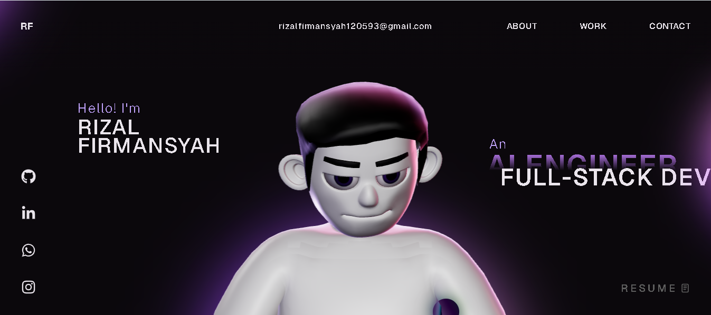
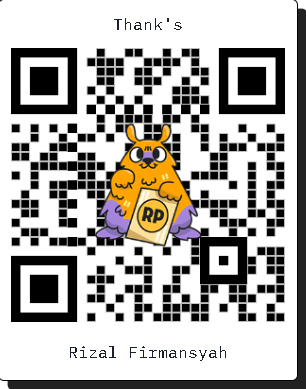

# 🚀 3D Developer Portfolio Website (React + TypeScript + Three.js)

[](./screen-capture%20(13).webm)

A modern, high-performance **3D developer portfolio website** built with **React**, **TypeScript**, **Three.js**, **GSAP**, and **WebGL**.

If you’re a developer looking for a **portfolio template** that feels premium, interactive, and memorable—this repo is for you.

> Live preview: 

---

## ✨ Highlights

- **3D / WebGL experience** powered by **Three.js**
- Smooth animations with **GSAP**
- Modern **React + TypeScript** codebase
- Fast, responsive UI (desktop + mobile)
- Designed for developers, engineers, programmers, and creators

---

## 🧰 Tech Stack

- **React**
- **TypeScript**
- **Three.js / WebGL**
- **GSAP**
- **HTML / CSS / JavaScript**

---

## 🚀 Getting Started

### 1) Clone

```bash
git clone https://github.com/rizalfirmansyah120593-byte/BEST-PORTOFOLIO-3D.git
cd BEST-PORTOFOLIO-3D
```

### 2) Install

```bash
npm install
```

### 3) Run locally

```bash
npm run dev
```

### 4) Build

```bash
npm run build
```

---

## 🧩 Customize (Quick Guide)

Typical things you’ll want to update:

- **Your name + hero section text**
- **Projects list**
- **Social links** (GitHub, LinkedIn, email)
- **SEO meta title/description**

---

## ⭐ Support

If you enjoy this project and want to support the development, you can scan the QR code below:



Atau klik link ini: [**Donasi via Saweria**](https://saweria.co/RizalFirmansyah)

---

## 🤝 Connect

- Whatsapp: https://wa.me/6281293161515

---

## 🏷️ Recommended GitHub Topics (add in repo settings)

Add these topics to improve GitHub search visibility:

`portfolio` `developer-portfolio` `portfolio-website` `portfolio-template` `3d-portfolio` `react` `typescript` `threejs` `webgl` `gsap` `frontend` `vite`

---

## 🪪 License

This project is open source and available under the **MIT License**. See [LICENSE](LICENSE).
